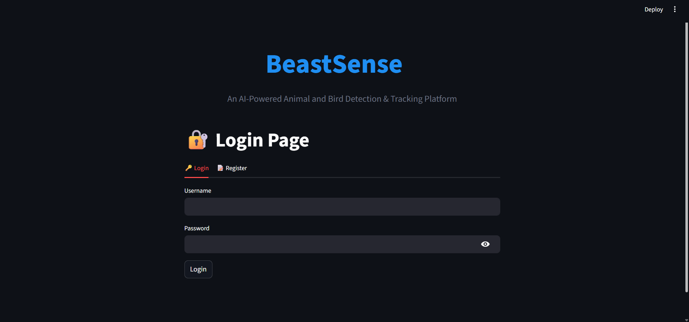
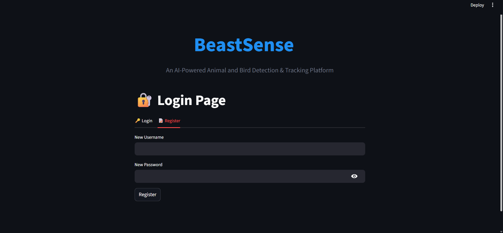
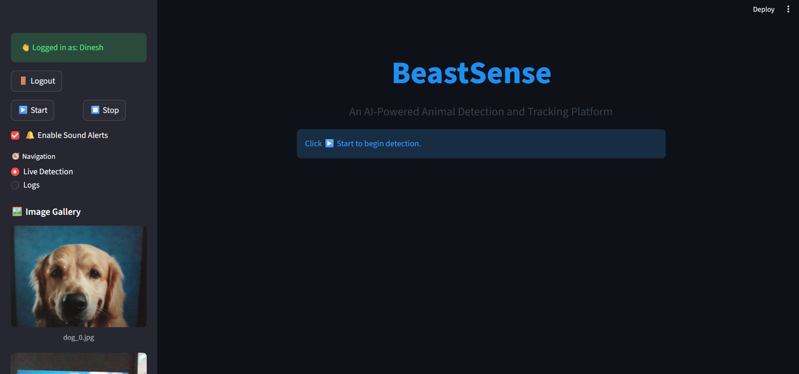
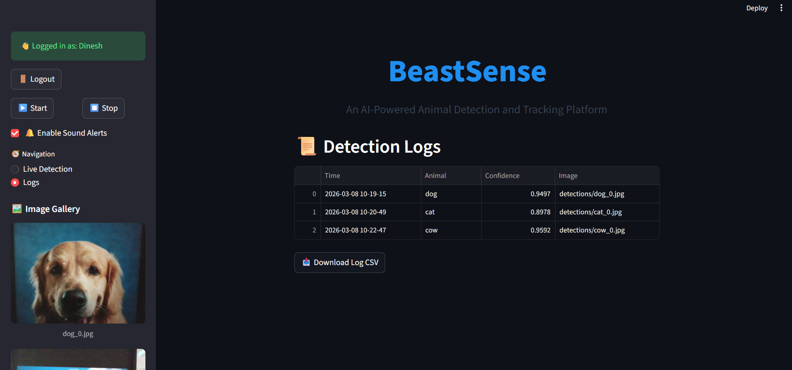

BeastSense
An AI-Powered Animal and Bird Detection & Tracking Platform

BeastSense is a modern AI-powered wildlife monitoring platform designed to detect and track animals and birds in real time using computer vision and deep learning. The system uses an intelligent object detection model to identify multiple animal species through a webcam feed and provide instant visual alerts and detection logs. Unlike traditional monitoring systems that require manual observation, BeastSense introduces intelligent automation using real time AI detection. The platform continuously analyzes live video frames, detects animals with confidence scores, tracks object movement, captures evidence images and records detailed logs automatically. This helps researchers, wildlife observers and security systems monitor animal activity efficiently.

Platform Overview

Users can log into the platform through a secure authentication system. Once logged in, the main dashboard allows users to start or stop the live detection system. The platform captures webcam video, runs the YOLOv8 object detection model on each frame, identifies animals, draws bounding boxes and displays detection statistics in real time. Whenever a new animal is detected, the system captures an image of the frame, stores it in the detections folder, records detection details such as time, confidence score, and image path in a CSV log file and optionally triggers a sound alert. The platform also provides a detection log viewer and an image gallery to review recent detections.

Project Background

Wild animals entering human habitats have increasingly become a concern, especially near forest areas, farms, and rural homes. Similarly, managing animals in zoos, monitoring pets and tracking endangered species in the wild require constant observation. Traditional surveillance methods are not only labor intensive but also lack real time alert capabilities. With advancements in artificial intelligence and computer vision, it has become possible to automate animal monitoring systems using deep learning models. Technologies such as YOLOv8 allow computers to identify objects in real time video streams. BeastSense uses this capability to detect animals and birds automatically, helping improve safety, wildlife monitoring and research activities.

Objectives

* Detect and track multiple animal and bird species using the YOLOv8 deep learning model
* Perform real time video analysis with bounding boxes and labels
* Generate sound alerts using an audio notification system
* Capture image snapshots whenever animals are detected
* Log detection data including timestamp, animal class, confidence score and image path into a CSV file
* Provide an interactive Streamlit based dashboard for monitoring, logs and gallery viewing
* Improve safety for humans, support animal monitoring systems and assist wildlife conservation research

Core Features

* Secure login and registration system for users
* Real time animal and bird detection using webcam feed
* Intelligent object tracking to avoid duplicate counting
* Automatic image capture when new animals are detected
* Detection logs stored with time, animal name, confidence score and image
* Downloadable detection log CSV file
* Sound alert system for new detections
* Live detection statistics displayed on screen
* Image gallery showing recently detected animals
* Clean and interactive dashboard interface built with Streamlit

Applications

* Home Security - The system can warn residents when wild animals approach homes located near forests or rural areas.
* Agricultural Surveillance - Farmers can monitor crop fields and detect animal intrusions that may damage agricultural land.
* Zoo and Pet Monitoring - Zoo authorities and pet shelters can track animal movements and detect unusual activities or escapes.
* Wildlife Conservation - Researchers can use the system to monitor endangered animals or observe wildlife activity in protected environments.
* Research and Education - The platform can provide real-time annotated visual data useful for academic learning and wildlife studies.

AI and Intelligent Detection

BeastSense uses the YOLOv8 deep learning model for real time object detection. Each video frame from the webcam is analyzed to identify animals and birds. The system filters detections using a confidence threshold to ensure reliable predictions. A lightweight tracking logic compares the center positions of detected objects between frames. If the object is already tracked, the system updates its position. If it is new, the system registers it as a new detection, captures an image, logs the event and optionally plays an alert sound.

Technology Stack

* Python used for core application development
* Streamlit used for building the interactive web dashboard
* OpenCV used for webcam capture and video frame processing
* YOLOv8 deep learning model used for real time object detection
* Pandas used for data logging and CSV management
* Pygame used for detection alert sound system

The vision of BeastSense is to simplify wildlife observation and animal monitoring using artificial intelligence. Monitoring animals manually is time consuming and often unreliable in large environments such as forests, farms and conservation zones. By combining computer vision with real time detection models, BeastSense allows users to detect animal presence instantly, capture visual evidence and maintain structured logs for analysis. The system can assist wildlife researchers, farmers, conservation organizations and smart surveillance systems in monitoring animal activity more efficiently.

Created By
Dinesh Pandiyan

Project Screenshots

Login Page

Register Page

Live Detection

Detection Logs

